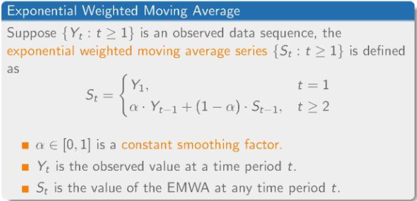
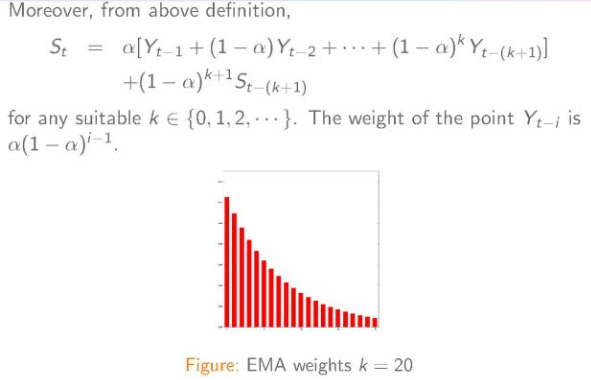
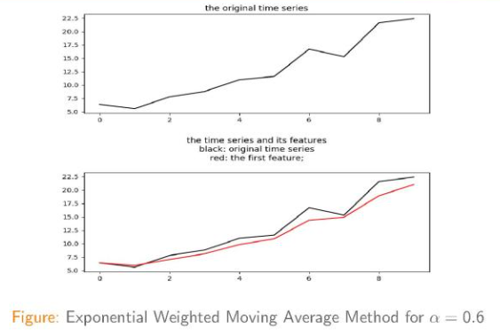
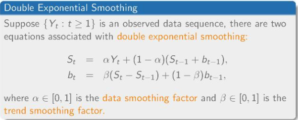
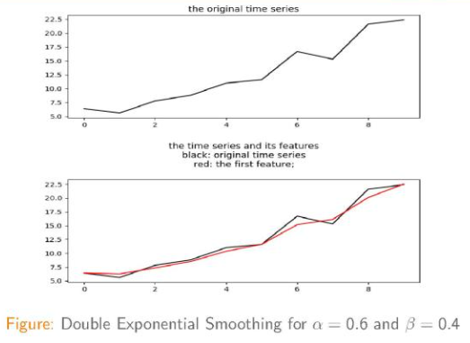
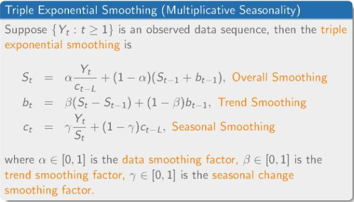
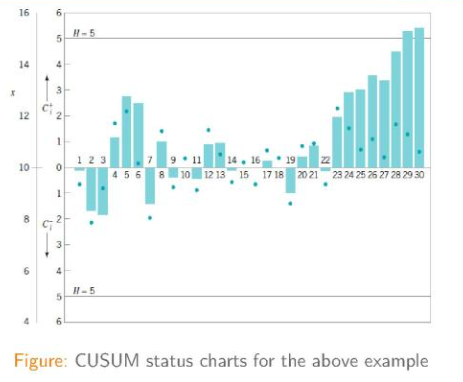
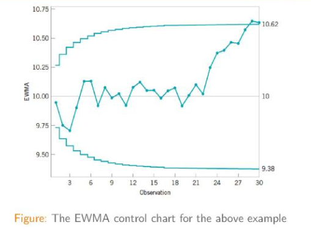
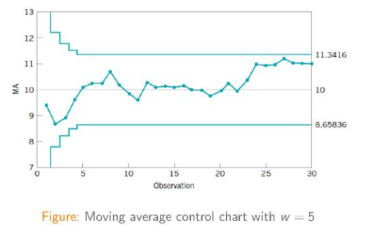

## 时间序列简介

　　整合了来自[https://zhuanlan.zhihu.com/p/32584136]()介绍的时间序列简介PPT的要点，纯作个人笔记使用。

### 1.时间序列算法

### 2.控制图理论

### 3.Opprentice系统

### 4.tsfresh python package

#### 1.时间序列算法

　　时间序列分析的方法分为：

　　　　时域：自相关系数和互相关系数

　　　　频域：谱分析和波分析

　　或：

　　　　参数方法

　　　　非参数方法

​	

　　滑动平均 Moving Average

　　　　每一个点都是之前w个点的平均数（包括该点）

　　累计滑动平均 Cumulative Moving Average

　　　　每一个点是之前所有点的平均数

　　加权滑动平均 Weighted Moving Average

　　　　每一个点是之前w个点的加权和（包括该点）

　　指数加权滑动平均 Exponential Weighted Moving Average

　　　　

　　　　

　　　　

　　双指数平滑 Double Exponential Smoothing

　　　　

　　　　

　　三指数平滑 Triple Exponential Smoothing

　　　　

​		

#### 2.控制图理论

　　控制图用来对图表的一些特征进行控制和分析，主要有三条线：

　　　　中心线：均值

　　　　上界和下界 Upper/Lower Control Limit

　　3 $\sigma$ 控制图
$$
UCL = \mu_{w} + L\sigma_{w}
$$

$$
Center Line = \mu_{w}
$$

$$
LCL = \mu_{w} - L\sigma_{w}
$$

　　　　L为控制线到中心线的距离，$\sigma$为w的标准差

　　累计和控制图 The Cumulative Sum Control Chart

　　　　

　　　　允许某些数据点有一定的偏移

　　　　表格和算法控制图要点：

　　　　

　　　　

　　指数滑动平均控制图 EWMA Control Chart
$$
UCL = \mu_{0} + L\sigma\sqrt{\frac{\lambda}{(2-\lambda)}}
$$

$$
Center Line = \mu_{0}
$$

$$
LCL = \mu_{0} - L\sigma\sqrt{\frac{\lambda}{(2-\lambda)}}
$$

　　　　其中$0\leq\lambda\leq1​$（省去推导过程）。

　　　　

　　滑动平均控制图 MA Control Chart
$$
UCL = \mu_{0} + \frac{3\sigma}{\sqrt{w}}
$$

$$
Center Line = \mu_{0}
$$

$$
LCL = \mu_{0} - \frac{3\sigma}{\sqrt{w}}
$$

　　　　

　　多元数据控制图，包括：

　　　　Hotelling  $T^{2}$ Control Chart

　　　　The Multivariate EWMA Control Chart

　　　　Regression Adjustment

　　　　Principal Components Method

　　　　Partial Least Squares

#### 3.Opprentice 系统

　　通过用户标注异常数据来进行有监督的机器学习的异常检测系统

#### 4.tsfresh python package

　　用来一次性提取时间序列中的千余种特征，并包括自动选择有效特征的功能，从而免去了为机器学习服务的特征工程。

　　相关使用样例在目录tsfresh_examples中。