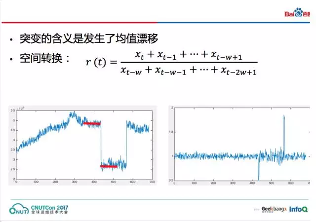

## 异常检测算法简述

　　————from [AIOps智能运维](https://mp.weixin.qq.com/s?__biz=MzUyMzA3MTY1NA==&mid=2247483953&idx=1&sn=a259fb48ac9fc097a95eee470f02cf13&chksm=f9c37bf8ceb4f2ee09d9dec2b15774a3686739812b76204ca5a8806189d74871434f63594011&mpshare=1&scene=1&srcid=0303RoucAK0617LdY1jGAuHj#rd)

　　异常检测系统面临的两个挑战：一是**数据规模大**，总共有百万量级的指标；二是曲线的**特征差异明显**，监控难度大。

　　曲线的三个场景：  
　　场景一：数据无规律波动，但基本在一个较小的波动范围内，典型的场景就是拒绝数监控，通常按照拒绝数的常态波动范围设定一个或多个恒定阈值，超过即报警。  
　　场景二：数据的长期波动幅度较大，但正常情况下短期的波动幅度较小，体现在图像上是一根比较光滑的曲线，不应该有突然性的上涨或下跌。典型的场景包括糯米的订单、流水。这类场景监控的主要思想就是环比附近的数据，检查是否存在突然的大幅上涨或下跌。  
　　场景三：数据有规律地周期性波动，比如广告收入或搜索流量等。检测这类数据的方法是与历史数据作同比，从而发现异常。

### 恒定阈值类算法

　　首先设定阈值，超过阈值则报警。拒绝数报警：假定在一个单位时间内超过n个拒绝就报警。但是实际中会出现单点毛刺的问题，即一个单点超过阈值。当数据来回抖动时，就会产生大量无效报警。常见方法就是通过**filter**来解决，比如设置为连续5个时刻都超过阈值才报警。  
　　更加柔性的**累积法**：一段时间窗口内数据的均值超过阈值触发报警。这样不但能滤除毛刺，还考虑了原始数据的累计效应。

### 突升突降类算法

　　突变的含义是发生了均值漂移。通过求取数据最近两个窗口的均值变化比例，将原始数据转换到变化比例空间（**r空间**）。在r空间上设置阈值就可以检测数据的突升或突降。类似于差分法。  

### 同比类算法

　　场景三中的数据有显著的周期性，首先计算历史上相同时间窗口内数据的均值和标准差，然后计算当前点的**z-scrore值**，即当前点的值减去均值再除以标准差。这样逐点计算z值可以把原始数据转换到另外一个空间（**z空间**），在z空间设置阈值就可以发现异常了。  

### 算法选择决策树&参数自动配置算法

　　混合场景包含了不同的曲线，则需要用到不同的算法。另外，算法在不同时段的参数也不同，因此参数配置成本很高。曲线特征还会随着业务系统和架构调整发生相应的变化，算法和参数需要定期维护。因此，希望能够自动选择算法和配置参数。

#### 算法选择决策树

　　曲线配置算法的本质是建立数据特点与算法本身的映射。

　　首先判断数据是否具有周期性，再来判断非周期性数据的波动范围。

　　先进行一阶**差分**，如果是周期性数据，差分后就可以消除原有数据的全局波动，然后结合方差的阈值判断就可以确定数据是否具有周期性（方差较小则表面是周期性数据，方差很大则表明有波动）。实验发现，不同天的数据有一定的上下浮动，因此差分前可以先对数据做**归一化**。

　　数据方差可以直接表达全局波动范围。对数据施加小尺度的小波变换就可以得到局部波动，局部波动的方差反应了局部波动的大小。

#### 参数自动配置方法

　　首先介绍恒定阈值的自动参数配置。如左下小图中的一段数据，直观来说红色区域的数值因为很罕见所以一般会被认为是有异常。通过估算这些罕见数据出现的概率，即可确定曲线的阈值。把数据看作是一组独立同分布的随机变量的值，我们可以使用 **ECDF**（经验累积概率分布曲线）来估计随机变量的概率分布（右下角的小图所示）。ECDF曲线的横轴是数据值，纵轴是概率，表达的是小于等于某数值的样本比例。用户给定经验故障概率（ECDF的纵轴），即可查找到数值的阈值（ECDF的横轴）。我们通过ECDF把配置阈值转换成了配置经验故障概率。尽管不同曲线的阈值不一样，但曲线的经验故障概率常常是一致的。实际使用中，因为历史数据样本有限，ECDF与真实CDF有一定差距，直接使用容易有较多误报，我们使用了补偿系数解决这个问题。

　　突升突降算法自动配置参数也是类似的，可以利用前文的空间转换公式把原始数据转换到r空间，然后在r空间尚配置恒定阈值。除了r空间上的阈值，还有窗口大小w需要设置，不同曲线一般不会有太大区别，我们就不自动设置了。

　　同比算法也一样，先转换到z空间，然后设置恒定阈值，同比天数k和窗口大小w一般也可以使用全局设置。

#### 疑惑点

1. cusum-归一化
2. 小波变换
3. ECDF的补偿系数